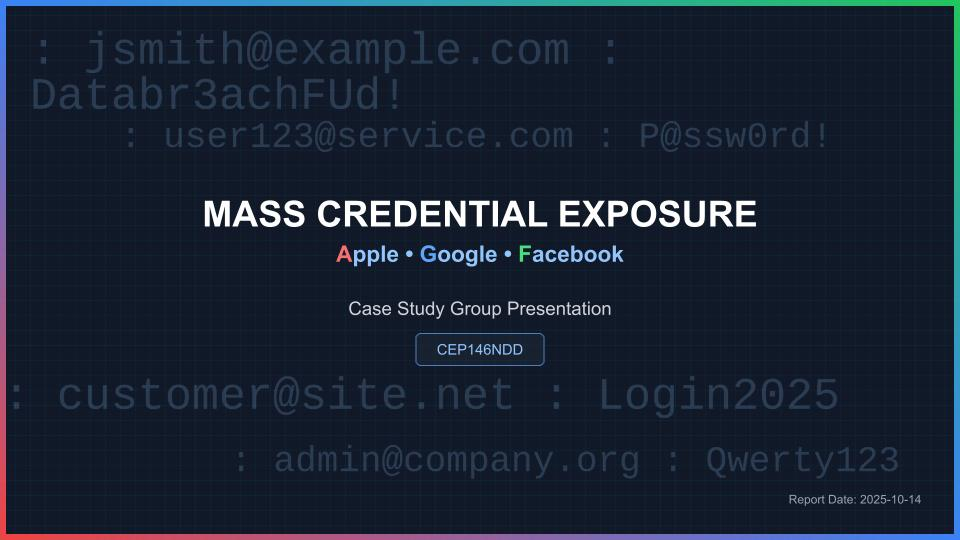

## Mass Credential Exposure Case Study

### [Mass Credential Exposure Case Study](https://youtu.be/O1_JQNPSpIo) 

> - Team members& roles :
>  - Video Presentation   : Mateo`Student #110161254`
>  - Research & summary   : Vansh`Student #139106249`
>  - Summary & script     : Vipishan `Student #104170220`
>  - Build PPTX & script  : Taishi`Student #`& Timothy`Student #177133212`

####  - Topic summary             
In June 2025, over 16 billion login credentials were exposed across ~30 datasets on the dark web, mainly from infostealer malware and historical data breaches. Major platforms like Apple, Google, and Facebook were not directly breached, but their user credentials were found in aggregated datasets.
####  - Final question:            
If passwords are clearly such a weak link, do you think users should still be given the choice to use them — or should companies start phasing them out completely in favour of passkeys and biometrics, even if it means less user freedom?
